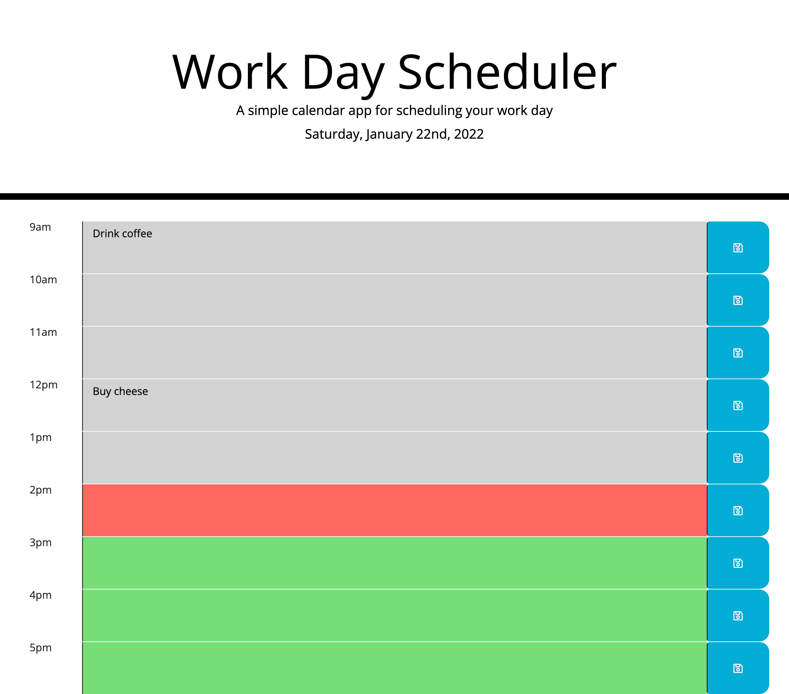

# 05 Third-Party APIs: Work Day Scheduler

## Description

Create a simple calendar application that allows a user to save events for each hour of the day by modifying starter code. This app will run in the browser and feature dynamically updated HTML and CSS powered by jQuery.

## Screenshot

## Links to the Application

- Here is the repo: [bgould86/hw5](https://github.com/bgould86/hw5)
- Here is the pages: [bgould86/pages](https://bgould86.github.io/hw5/)
